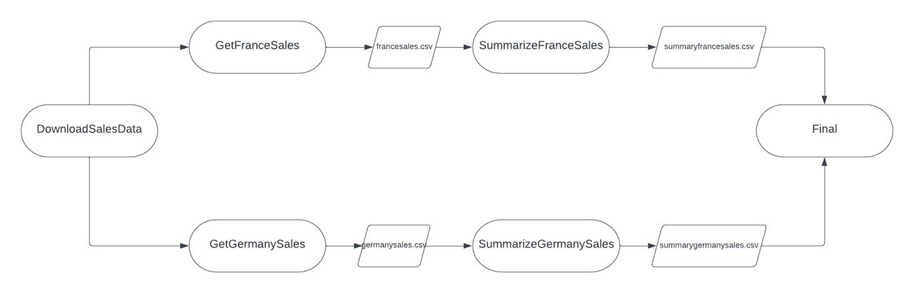

# My-First-Data-Pipeline

Implementing a smart data pipeline with Luigi and Python.

## sales-summaries

#### Type of task:

- Many parallel and successive tasks

#### Description:

- Creates a pipeline runs multiple parallel and successive tasks
- The first task leads to two different tasks that run in parallel, with each task producing and output. These outputs are required to initiate the successive two tasks which also have outputs. The last outputs are then processed in a final wrapper task that produces a singular output.

## parallel-downloads

#### Type of task:

- Parallel task

#### Description:

- Creates a pipeline that downloads 3 csv files, and uploads them to an S3 bucket in AWS
- Task 1 and Task 2 run in parallel,then task 3 runs dependent on the completion of both task one and two.

## csv-to-sql

#### Type of task:

- Parallel and successive task

#### Description:

- Creates a pipeline that merges two csv files `france.csv` and `germany.csv` into a new SQLite Database `test.db`.
- Task 1 and Task 2 run in parallel,then task 3 runs dependent on the completion of both task one and two.
